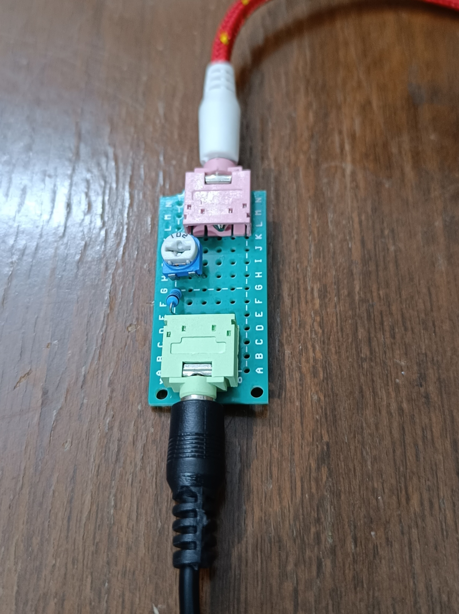
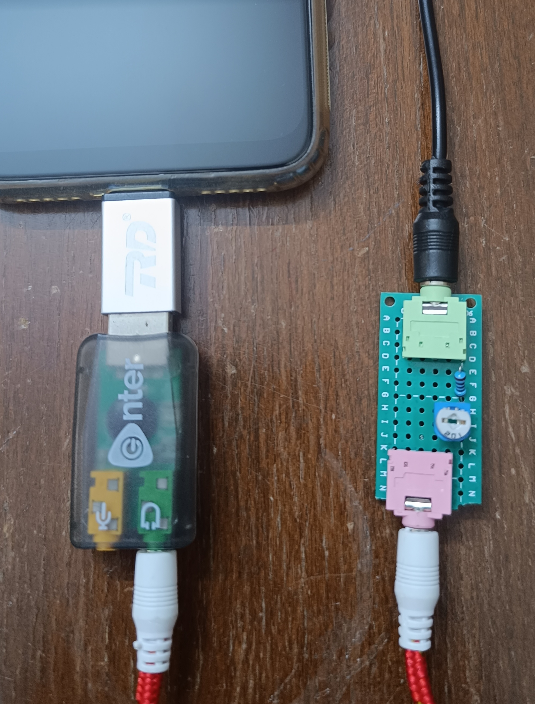
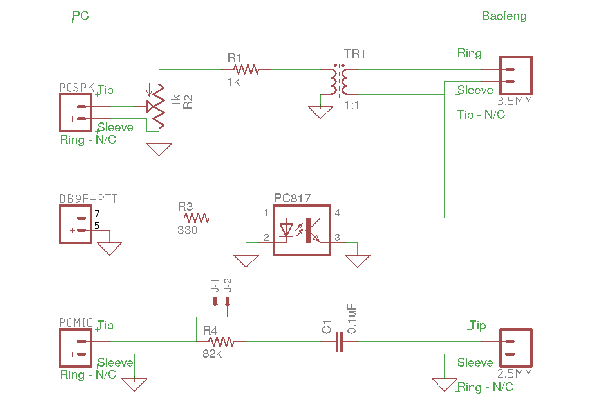
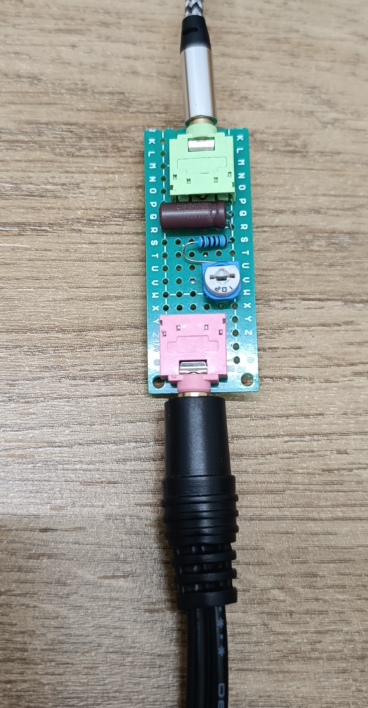
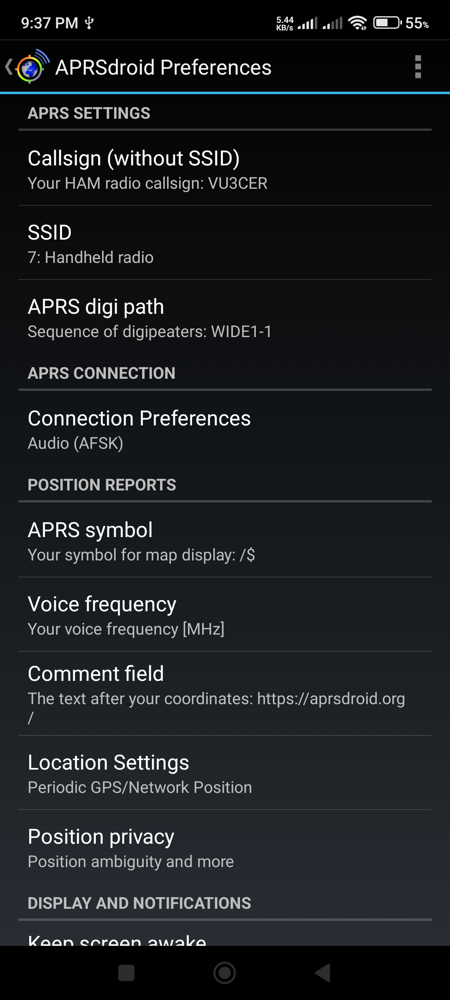
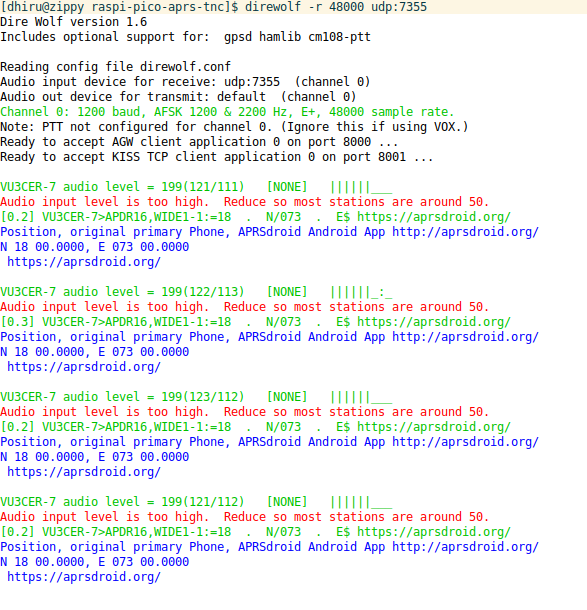
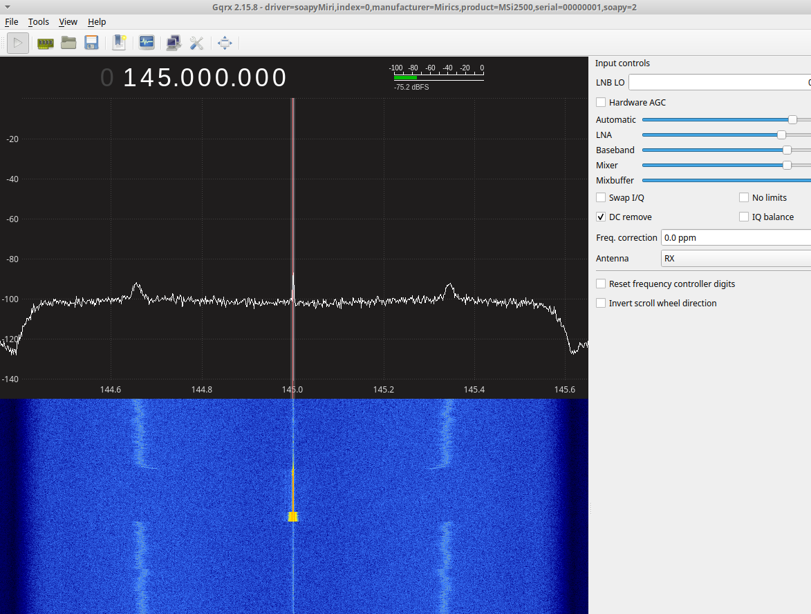

# Phone powered APRS RF Beacon

This project is published by PHARC (Pune HAM club).

This repository documents the process of connecting an (Android) phone to
BaoFeng VHF/UHF radio. By doing so, we can utilize `APRSdroid` running on
the phone to create an APRS RF Beacon in a cost-effective fashion.

Time required: 10 minutes or less.

Cost: Around 450 INR or less (for TX, slightly more for TX + RX). In
comparison, the original `BTECH APRS-K1 Audio Cable` cable costs around 1700
INR, and might be hard to source locally. This original cable is compact but it
isn't as versatile as our solution. Many of such cables suffer from poor
quality (mechanical tolerances, and longevity issues).

Availability: All components are easily source-able online or from your local
electronics market.

## BOM

- USB Sound Card - 125 INR - Robu.in and others

- OTG adapter (good quality) - 60 INR - https://etstore.in and others

- Standard 3.5mm TRS aux cable * 4 - 50 INR to 125 INR each - https://www.electroncomponents.com, https://rarecomponents.com

- 3.5mm Stereo Female Switched Socket (5 Pin) * 4 - 10 INR each - https://projectpoint.in

- 3.5mm TRS male plug - 15 INR (https://projectpoint.in and others) - Only used for debugging, and figuring out the pinouts

- Small 'Zero PCB' board (FR-4 Double Side PCB - 2x8cm) * 2 OR bigger PCB - 35 INR - Robu.in

- 1K (102) RM065 Trimmer - 6 INR - https://projectpoint.in

- 1K MFR resistor - 2 INR - https://projectpoint.in

- 10uF MLCC capacitor (1206 SMD is fine) for isolation - https://evelta.com/ and others

- [For RX] 2.5mm To 3.5mm Stereo Female Socket cable - 200 INR - https://www.electronicscomp.com

- [For RX] 82K MFR resistor - 2 INR - https://projectpoint.in

- [For RX] Vishay 100nF MLCC capacitor - 5 INR - https://projectpoint.in

## Design Notes

- While 100% possible, chopping up cables is a bit inelegant (also sometimes
  the fine wires inside the chopped cables require precise handling which not
  everyone can handle).

- Some phones don't have audio socket anymore...

- Direct connection without isolation is a bit suspect - Imagine 5W "Back RF"
  getting into the phone - Won't be a fun day for sure.

- The TRRS "standard" is a bit varying one and not 100% standardized - super annoying!

All these points were carefully considered in our solution for it to be
suitable for a wide audience (but surely not for everybody). Your mileage will
vary as usual (TM).

## Circuit





Note 1: This exposed shim adapter will be protected using a heat shrink tube a
bit later on.

Note 2: For beacon purposes, we just need the `TX` part of the following
circuit. We replace the `TR1` transformer with a simple series 10uF MLCC cap to
"gain" compactness.

Note 3: Set the pot to the middle position, and play around with different
values.



Another build:



## APRSdroid Settings



## Tips

- Enable `VOX` mode on your BaoFeng radio.

- You can use an SDR to monitor and decode your own transmissions.

  ```
  direwolf -r 48000 udp:7355
  ```

  https://www.gqrx.dk/doc/streaming-audio-over-udp - Setup Gqrx using this
  documentation.

## Results

It works!





## References

- https://www.miklor.com/COM/UV_Technical.php

- https://k0rx.com/blog/2017/11/baofeng.html (Thanks https://github.com/rafal-rozestwinski/)

- https://gqrx.dk/doc/streaming-audio-over-udp

- https://aprsdroid.org/download/

- https://ae5pl.net/javAPRSSrvrIGate.aspsimple

- https://en.wikipedia.org/wiki/Galvanic_isolation
